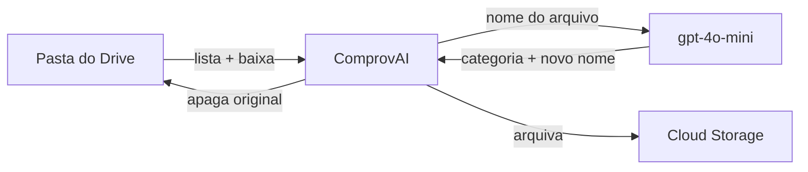

# ComprovAI

Organiza comprovantes de pagamento automaticamente: lê uma pasta do Google Drive, classifica cada arquivo com IA, renomeia seguindo um padrão e arquiva no Google Cloud Storage.

---

## O problema

Comprovante de água, boleto de luz, IPTU, PIX — tudo cai na mesma pasta do Drive, cada um com um nome diferente (`Comprovante-2847.pdf`, `IMG_0032.png`, `boleto (3).pdf`). Na hora de achar o comprovante de energia de março, é caçada manual.

O ComprovAI roda de tempos em tempos, esvazia essa pasta e devolve um acervo organizado:

```
gs://seu-bucket/
├── agua/      energia_mar_2026_enel.png
├── energia/   iptu_abr_2026_paulista_1100.pdf
├── iptu/      pix_jul_2026_marina.pdf
├── pix/       ...
├── convenio/
├── ir/
└── outros/
```

## Como funciona



A cada invocação HTTP, a função `run` em [main.py](main.py):

1. Lista os arquivos da pasta definida em `DRIVE_FOLDER_ID` (ignora subpastas e itens na lixeira). Sem arquivos, encerra com `200`.
2. Para cada arquivo:
   - **classifica** — manda o nome original + o mês/ano corrente para o `gpt-4o-mini`, que devolve a categoria e o novo nome;
   - **baixa** o conteúdo do Drive para a memória;
   - **arquiva** em `gs://{bucket}/{categoria}/{novo_nome}`;
   - **apaga** o original do Drive.
3. Devolve um resumo em JSON do lote.

Cada arquivo é processado de forma isolada: se um falhar, ele entra na lista de `failed` e o lote continua.

## Categorias e padrão de nomes

| Categoria  | O que cai nela                              |
| ---------- | ------------------------------------------- |
| `agua`     | Sabesp, Copasa e afins                      |
| `energia`  | Enel, Cemig, Light e afins                  |
| `iptu`     | IPTU                                        |
| `pix`      | PIX, TED, transferências                    |
| `convenio` | Convênio, plano de saúde                    |
| `ir`       | Imposto de renda (declaração, restituição)  |
| `outros`   | O que não se encaixa acima                  |

O novo nome segue `{categoria}_{mes}_{ano}_{detalhes}.{extensao}` — sempre minúsculo, sem espaços, mês abreviado em três letras. Se o nome original já traz mês/ano, eles são reaproveitados; senão vale a data corrente (fuso `America/Sao_Paulo`).

| Nome original                         | Vira                               |
| ------------------------------------- | ---------------------------------- |
| `iptu_paulista_1100.pdf`              | `iptu_abr_2026_paulista_1100.pdf`  |
| `luz_marco_enel.png`                  | `energia_mar_2026_enel.png`        |
| `convenio_marina.pdf`                 | `convenio_abr_2026_marina.pdf`     |
| `declaracao_anual_guilherme_inss.pdf` | `ir_abr_2026_guilherme_inss.pdf`   |

As categorias são travadas por JSON Schema na chamada ao modelo ([classifier.py](src/classifier/classifier.py)), então o LLM não consegue inventar uma categoria nova. As regras de nomenclatura ficam em [prompts.py](src/classifier/prompts.py).

## Por que duas identidades do Google

Este é o ponto menos óbvio do projeto, e a principal fonte de confusão no setup: o ComprovAI usa **duas credenciais diferentes** para falar com o mesmo Drive.

| Operação        | Identidade                 | Escopo           |
| --------------- | -------------------------- | ---------------- |
| Listar e baixar | Service account (via ADC)  | `drive.readonly` |
| Apagar          | Token OAuth de usuário     | `drive`          |

O motivo: uma service account **não consegue apagar arquivos de uma conta pessoal do Google**, mesmo com a pasta compartilhada com ela — o arquivo pertence a você, não a ela. Por isso a exclusão passa por um token OAuth autorizado pela sua própria conta ([drive.py](src/drive/drive.py)).

Quando esse token expira, ele é renovado e a versão nova é gravada de volta no Secret Manager, para sobreviver ao reinício do container.

## Stack

- **Python 3.11** + [functions-framework](https://github.com/GoogleCloudPlatform/functions-framework-python)
- **OpenAI** `gpt-4o-mini` com structured output (JSON Schema, `temperature=0`)
- **Google Drive API v3**, **Cloud Storage**, **Secret Manager**
- **Cloud Run** (modo função), com build via Buildpacks — não há Dockerfile
- **Cloud Build** para o deploy contínuo

## Estrutura

```
.
├── main.py                    # entrypoint HTTP — orquestra o pipeline
├── cloudbuild.yaml            # pipeline de deploy
├── requirements.txt
└── src/
    ├── classifier/
    │   ├── classifier.py      # chamada ao LLM com JSON Schema
    │   └── prompts.py         # categorias e regras de nomenclatura
    ├── drive/
    │   └── drive.py           # listar, baixar, apagar + as duas autenticações
    ├── storage/
    │   └── gcs.py             # upload para o bucket
    ├── logger.py
    └── utils.py               # data corrente no fuso de São Paulo
```

## Pré-requisitos no GCP

**1. Habilite as APIs:**

```bash
gcloud services enable \
  run.googleapis.com \
  cloudbuild.googleapis.com \
  drive.googleapis.com \
  storage.googleapis.com \
  secretmanager.googleapis.com
```

**2. Crie o bucket:**

```bash
gcloud storage buckets create gs://SEU_BUCKET --location=southamerica-east1
```

**3. Crie a service account e dê as permissões:**

```bash
gcloud iam service-accounts create receipt-payment-organizer

# escrever no bucket
gcloud storage buckets add-iam-policy-binding gs://SEU_BUCKET \
  --member=serviceAccount:receipt-payment-organizer@SEU_PROJETO.iam.gserviceaccount.com \
  --role=roles/storage.objectAdmin
```

**4. Compartilhe a pasta do Drive** com o e-mail da service account (`receipt-payment-organizer@SEU_PROJETO.iam.gserviceaccount.com`), como leitor. O `DRIVE_FOLDER_ID` é o trecho final da URL da pasta: `drive.google.com/drive/folders/`**`<esse-id-aqui>`**.

**5. Crie os 5 secrets** no Secret Manager — o Cloud Build lê todos eles no deploy:

| Secret              | Conteúdo                                        |
| ------------------- | ----------------------------------------------- |
| `OPENAI_API_KEY`    | sua chave da OpenAI                             |
| `GCS_BUCKET_NAME`   | nome do bucket                                  |
| `DRIVE_FOLDER_ID`   | ID da pasta de entrada                          |
| `OAUTH_CREDENTIALS` | JSON do cliente OAuth (tipo *app instalado*)    |
| `OAUTH_TOKEN`       | JSON do token gerado no bootstrap (veja abaixo) |

```bash
printf 'SEU_VALOR' | gcloud secrets create OPENAI_API_KEY --data-file=-
```

A service account precisa poder gravar novas versões do token renovado:

```bash
gcloud secrets add-iam-policy-binding OAUTH_TOKEN \
  --member=serviceAccount:receipt-payment-organizer@SEU_PROJETO.iam.gserviceaccount.com \
  --role=roles/secretmanager.secretVersionAdder
```

E a service account do Cloud Build precisa de `roles/secretmanager.secretAccessor` nos cinco secrets, além de permissão para fazer deploy no Cloud Run.

## Variáveis de ambiente

| Variável                         | Obrigatória | Descrição                                                             |
| -------------------------------- | ----------- | --------------------------------------------------------------------- |
| `OPENAI_API_KEY`                 | sim         | Lida automaticamente pelo SDK da OpenAI                               |
| `GCS_BUCKET_NAME`                | sim         | Bucket de destino                                                     |
| `DRIVE_FOLDER_ID`                | sim         | Pasta de entrada no Drive                                             |
| `OAUTH_CREDENTIALS_FILE`         | não         | Padrão `oauth-credentials.json`                                       |
| `OAUTH_TOKEN_FILE`               | não         | Padrão `oauth-token.json`                                             |
| `GOOGLE_APPLICATION_CREDENTIALS` | só local    | Caminho do `service-account.json`; no Cloud Run o ADC resolve sozinho |

Copie o [.env.example](.env.example) para `.env` e preencha.

## Bootstrap do OAuth (passo obrigatório)

O fluxo OAuth abre um navegador para você autorizar o acesso — o que **só funciona na sua máquina**, nunca no Cloud Run. Faça isso uma vez, antes do primeiro deploy:

1. No Google Cloud Console, crie uma credencial OAuth do tipo **App para computador** e baixe o JSON como `oauth-credentials.json` na raiz do projeto.
2. Rode o projeto localmente (seção abaixo) e dispare uma execução. Na hora de apagar o primeiro arquivo, o navegador abre pedindo autorização.
3. Autorize. O arquivo `oauth-token.json` é gravado na raiz.
4. Publique os dois no Secret Manager:

```bash
gcloud secrets create OAUTH_CREDENTIALS --data-file=oauth-credentials.json
gcloud secrets create OAUTH_TOKEN       --data-file=oauth-token.json
```

Sem esse passo o deploy sobe normalmente, mas a função não consegue apagar nada do Drive — e falha com uma mensagem pedindo exatamente este bootstrap.

> Os três arquivos de credencial (`service-account.json`, `oauth-credentials.json`, `oauth-token.json`) estão no `.gitignore` e nunca devem ser commitados.

## Rodando localmente

```bash
python -m venv .venv
.venv\Scripts\activate          # Windows
source .venv/bin/activate       # macOS / Linux

pip install -r requirements.txt
cp .env.example .env            # preencha os valores
```

Coloque `service-account.json` e `oauth-credentials.json` na raiz e suba o servidor:

```bash
functions-framework --target=run --debug --port=8080
```

Dispare uma execução (o corpo da requisição é ignorado):

```bash
curl http://localhost:8080
```

## Deploy

O deploy é automático: **todo push na `main`** dispara o Cloud Build, que executa o [cloudbuild.yaml](cloudbuild.yaml) em dois passos:

1. Materializa `oauth-credentials.json` e `oauth-token.json` no workspace a partir do Secret Manager — eles não existem no repositório.
2. Roda `gcloud beta run deploy comprovai --source=. --function=run`, que constrói a imagem via Buildpacks e publica em `southamerica-east1` com 512 Mi e timeout de 300 s.

O serviço sobe como **privado** (`--no-allow-unauthenticated`).

Para deployar manualmente:

```bash
gcloud builds submit --config=cloudbuild.yaml
```

## Agendamento

Como o serviço é privado, o agendamento precisa de um Cloud Scheduler autenticado via OIDC:

```bash
URL=$(gcloud run services describe comprovai \
  --region=southamerica-east1 --format='value(status.url)')

gcloud scheduler jobs create http comprovai-diario \
  --location=southamerica-east1 \
  --schedule="0 9 * * *" \
  --time-zone="America/Sao_Paulo" \
  --uri="$URL" \
  --http-method=GET \
  --oidc-service-account-email=receipt-payment-organizer@SEU_PROJETO.iam.gserviceaccount.com
```

Para invocar na mão:

```bash
curl -H "Authorization: Bearer $(gcloud auth print-identity-token)" "$URL"
```

## Resposta

**200** — lote processado:

```json
{
  "status": "success",
  "processed": 2,
  "errors": 1,
  "results": [
    {
      "original_filename": "Comprovante-2847.pdf",
      "new_filename": "pix_jul_2026_marina.pdf",
      "category": "pix",
      "gcs_uri": "gs://meu-bucket/pix/pix_jul_2026_marina.pdf"
    }
  ],
  "failed": [
    { "filename": "IMG_0032.png", "error": "..." }
  ]
}
```

**400** — `DRIVE_FOLDER_ID` não configurado.
**500** — falha geral (autenticação, Drive indisponível). Falhas de arquivos individuais **não** geram 500; aparecem em `failed`.

Os logs saem em stdout e podem ser lidos com:

```bash
gcloud run services logs read comprovai --region=southamerica-east1
```

## Notas de comportamento

- **A classificação usa apenas o nome do arquivo** — não há OCR nem leitura do conteúdo. Um arquivo chamado `documento.pdf` cai em `outros`. A qualidade do resultado depende de quão descritivos são os nomes na origem.
- **A exclusão no Drive é permanente** (`files.delete`, não vai para a lixeira). O arquivo só é apagado depois do upload para o GCS ser confirmado.
- Cada arquivo é carregado inteiro em memória. O limite de 512 Mi comporta comprovantes normais com folga, mas não anexos muito grandes.
